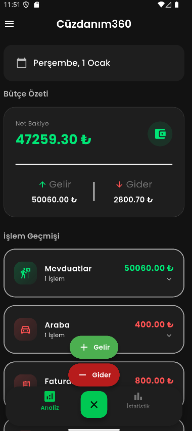
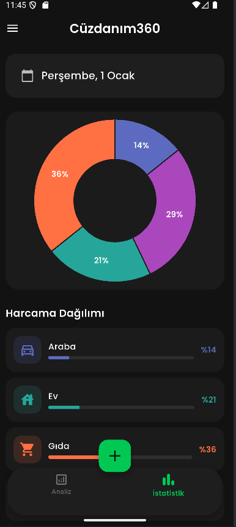
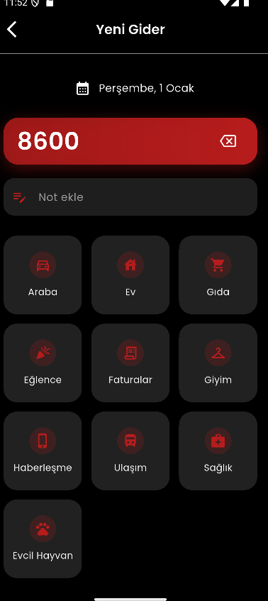
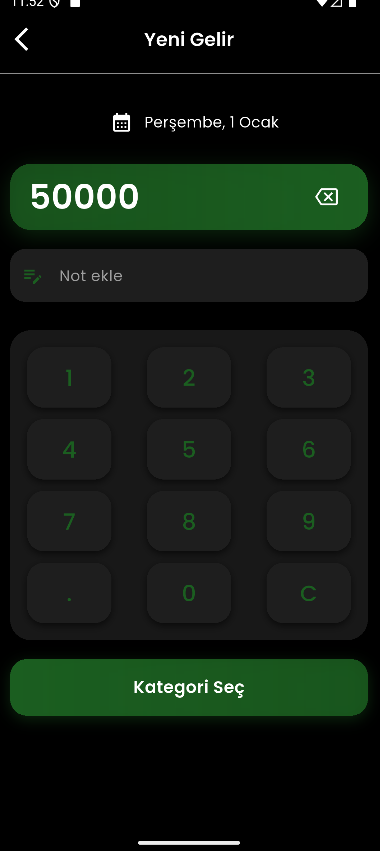

# 📱 Cüzdanım360
## Kişisel Finans Yönetimi için Modern Flutter Uygulaması

**Cüzdanım360**, bireylerin günlük finansal hareketlerini sistematik ve anlaşılır bir şekilde takip edebilmeleri amacıyla geliştirilmiş, **Flutter tabanlı** bir kişisel finans yönetim uygulamasıdır.

Uygulama; **BLoC mimarisi ile state management**, **SQLite destekli kalıcı veri saklama**, **animasyonlu ve responsive kullanıcı arayüzü** ve **Clean Architecture yaklaşımı** ile profesyonel ölçekte bir mobil uygulama yapısını hedeflemektedir.

---

## 🎯 Projenin Amacı

Bu projenin temel amacı:

- Kullanıcıların gelir ve giderlerini **kategori bazlı** ve **periyodik** olarak takip edebilmesini sağlamak  
- Flutter ekosisteminde **ölçeklenebilir mimari** ve **temiz kod prensipleri** uygulamak  
- Gerçek hayatta kullanılabilecek bir finans uygulaması senaryosu oluşturmak  
- BLoC pattern ile sürdürülebilir ve test edilebilir bir yapı kurmak  

---

## ✨ Temel Özellikler

### 💰 Gelir & Gider Yönetimi
- Özel tasarlanmış, kullanıcı dostu **hesap makinesi arayüzü**
- Gelir ve giderler için ayrı akışlar
- Kategori bazlı işlem ekleme:
  - Gıda
  - Maaş
  - Sağlık
  - Ulaşım
  - Araç
  - Diğer
- İşlem açıklaması / not ekleyebilme
- Günlük, aylık ve yıllık periyot seçimi

---

### 🗄️ SQLite ile Kalıcı Veri Saklama
- `sqflite` paketi ile local database yönetimi
- Autoincrement ID yapısı
- CRUD operasyonları (Create, Read, Update, Delete)
- Toplam bakiye hesaplama
- Kategori ve tarih bazlı veri filtreleme
- Offline çalışabilme desteği

---

### 🎨 Modern ve Animasyonlu Kullanıcı Arayüzü
- `AnimatedContainer` ile yumuşak geçiş animasyonları
- `ExpansionTile` ile açılır gelir/gider kartları
- Kategori bazlı ikon ve renk kullanımı
- Responsive tasarım (farklı ekran boyutları için uyumlu)
- Material Design prensiplerine uygun UI/UX

---

### 🧠 BLoC Tabanlı State Management
- `flutter_bloc` kullanılarak yapılandırılmış mimari
- Event – State ayrımı
- Sayfa durumlarının merkezi olarak yönetilmesi:
  - `idle`
  - `loading`
  - `success`
  - `error`
- UI ile business logic’in net ayrımı

---

## 🏗️ Mimari Yapı

Proje, **Clean Architecture** prensipleri doğrultusunda modüler ve ölçeklenebilir bir yapı ile tasarlanmıştır.  
Katmanlar arası bağımlılıklar minimum seviyede tutulmuş, sorumluluklar net bir şekilde ayrılmıştır.

```text
lib/
├── core/
│   ├── navigator.dart
│   └── sabitler.dart
│
├── home_page/
│   ├── bloc/
│   ├── view/
│   └── widgets/
│
├── income_expense_page/
│   ├── bloc/
│   │   ├── amount_calculator/
│   │   ├── db/
│   │   └── income_expense_page/
│   ├── view/
│   └── widgets/
│
├── analysis/
├── staticts/
└── main.dart
```
Bu yapı sayesinde:
- Kod okunabilirliği artar  
- Yeni özellik eklemek kolaylaşır  
- Test edilebilirlik sağlanır  

---

## 🛠️ Kullanılan Teknolojiler

| Teknoloji | Açıklama |
|---------|---------|
| Flutter | Cross-platform mobil uygulama geliştirme |
| Dart | Programlama dili |
| flutter_bloc | State management |
| SQLite | Local veri saklama |
| sqflite | SQLite Flutter entegrasyonu |
| Google Fonts | Tipografi |
| Clean Architecture | Mimari yaklaşım |

---

## 📱 Uygulama Ekran Görüntüleri

> Ekran görüntüleri `assets/screenshots/` dizini altında bulunmaktadır.

| Bütçe Analiz Sayfası | Gider İstatistikleri Sayfası | Gider Ekleme Sayfası | Gelir Ekleme Sayfası 
|----------|-----------|------------|------------|
|  |  |  | 

---

